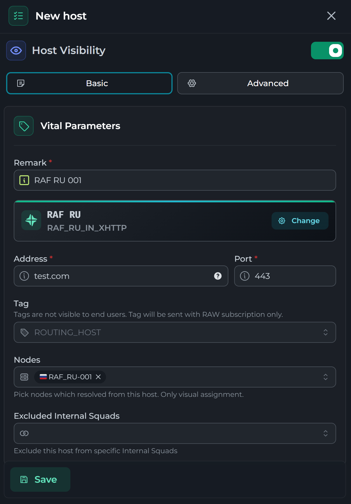
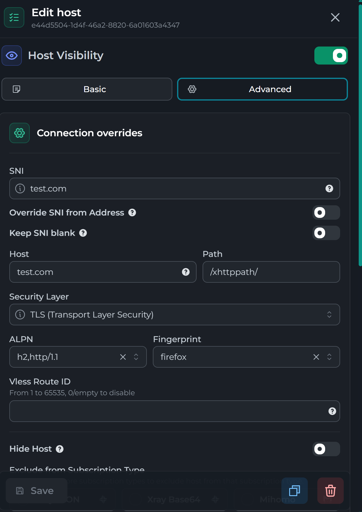

# CDN XHHTP


Я использую продукт как Remnamave и статья будет расписанна для него

## Подключаемся к ноде

Подключаемся по ssh и переходим в папку `/opt/remnanode` и открываем файл `nginx.comf`. Путь к данному файлу может отличаться. 


В северный блок кода добавляем следующий код:


```nginx
    location /xhttppath/ {
        client_max_body_size 0;
        proxy_set_header X-Real-IP $proxy_protocol_addr;
        proxy_set_header X-Forwarded-For $proxy_protocol_addr;
        proxy_set_header Host $host;
        proxy_set_header Upgrade $http_upgrade;
        proxy_set_header Connection $connection_upgrade;
        proxy_http_version 1.1;
        client_body_timeout 5m;
        proxy_read_timeout 315s;
        proxy_send_timeout 5m;
        proxy_pass http://unix:/dev/shm/xrxh.socket;
    }
```

### Пример отредактированного файла  `nginx.conf`

=== "Изначально"


    ```nginx
        server_names_hash_bucket_size 64;

        map $http_upgrade $connection_upgrade {
            default upgrade;
            ""      close;
        }

        ssl_protocols TLSv1.2 TLSv1.3;
        ssl_ecdh_curve X25519:prime256v1:secp384r1;
        ssl_ciphers ECDHE-ECDSA-AES128-GCM-SHA256:ECDHE-RSA-AES128-GCM-SHA256:ECDHE-ECDSA-AES256-GCM-SHA384:ECDHE-RSA-AES256-GCM-SHA384:ECDHE-ECDSA-CHACHA20-POLY1305:ECDHE-RSA-CHACHA20-POLY1305:DHE-RSA-AES128-GCM-SHA256:DHE-RSA-AES256-GCM-SHA384:DHE-RSA-CHACHA20-POLY1305;
        ssl_prefer_server_ciphers on;
        ssl_session_timeout 1d;
        ssl_session_cache shared:MozSSL:10m;
        ssl_session_tickets off;

        server {
            server_name halo.uovio.cc;
            listen unix:/dev/shm/nginx.sock ssl proxy_protocol;
            http2 on;

            ssl_certificate "/etc/nginx/ssl/raf.com/fullchain.pem";
            ssl_certificate_key "/etc/nginx/ssl/raf.com/privkey.pem";
            ssl_trusted_certificate "/etc/nginx/ssl/raf.com/fullchain.pem";

            root /var/www/html;
            index index.html;
            add_header X-Robots-Tag "noindex, nofollow, noarchive, nosnippet, noimageindex" always;
        }

        server {
            listen unix:/dev/shm/nginx.sock ssl proxy_protocol default_server;
            server_name _;
            add_header X-Robots-Tag "noindex, nofollow, noarchive, nosnippet, noimageindex" always;
            ssl_reject_handshake on;
            return 444;
        }

    ```


=== "После редактирования"

    ```nginx hl_lines="29-41"
        server_names_hash_bucket_size 64;

        map $http_upgrade $connection_upgrade {
            default upgrade;
            ""      close;
        }

        ssl_protocols TLSv1.2 TLSv1.3;
        ssl_ecdh_curve X25519:prime256v1:secp384r1;
        ssl_ciphers ECDHE-ECDSA-AES128-GCM-SHA256:ECDHE-RSA-AES128-GCM-SHA256:ECDHE-ECDSA-AES256-GCM-SHA384:ECDHE-RSA-AES256-GCM-SHA384:ECDHE-ECDSA-CHACHA20-POLY1305:ECDHE-RSA-CHACHA20-POLY1305:DHE-RSA-AES128-GCM-SHA256:DHE-RSA-AES256-GCM-SHA384:DHE-RSA-CHACHA20-POLY1305;
        ssl_prefer_server_ciphers on;
        ssl_session_timeout 1d;
        ssl_session_cache shared:MozSSL:10m;
        ssl_session_tickets off;

        server {
            server_name halo.uovio.cc;
            listen unix:/dev/shm/nginx.sock ssl proxy_protocol;
            http2 on;

            ssl_certificate "/etc/nginx/ssl/raf.com/fullchain.pem";
            ssl_certificate_key "/etc/nginx/ssl/raf.com/privkey.pem";
            ssl_trusted_certificate "/etc/nginx/ssl/raf.com/fullchain.pem";

            root /var/www/html;
            index index.html;
            add_header X-Robots-Tag "noindex, nofollow, noarchive, nosnippet, noimageindex" always;

            location /xhttppath/ {
                client_max_body_size 0;
                proxy_set_header X-Real-IP $proxy_protocol_addr;
                proxy_set_header X-Forwarded-For $proxy_protocol_addr;
                proxy_set_header Host $host;
                proxy_set_header Upgrade $http_upgrade;
                proxy_set_header Connection $connection_upgrade;
                proxy_http_version 1.1;
                client_body_timeout 5m;
                proxy_read_timeout 315s;
                proxy_send_timeout 5m;
                proxy_pass http://unix:/dev/shm/xrxh.socket;
            }
        }

        server {
            listen unix:/dev/shm/nginx.sock ssl proxy_protocol default_server;
            server_name _;
            add_header X-Robots-Tag "noindex, nofollow, noarchive, nosnippet, noimageindex" always;
            ssl_reject_handshake on;
            return 444;
        }
    ```


    Сохраняем файл:
    ```bash
      Ctrl + O
    ```

    Закрываем файл:
    ```bash
    Ctrl + X
    ```

## Настраиваем конфигурацию XHHTP в inbound в настройках config profiles


```json
    {
      "tag": "Sweden_XHTTP",
      "listen": "/dev/shm/xrxh.socket,0666",
      "protocol": "vless",
      "settings": {
        "clients": [],
        "fallbacks": [],
        "decryption": "none"
      },
      "sniffing": {
        "enabled": true,
        "destOverride": [
          "http",
          "tls",
          "quic"
        ]
      },
      "streamSettings": {
        "network": "xhttp",
        "xhttpSettings": {
          "mode": "auto",
          "path": "/xhttppath/",
          "extra": {
            "noSSEHeader": true,
            "xPaddingBytes": "100-1000",
            "scMaxBufferedPosts": 30,
            "scMaxEachPostBytes": 1000000,
            "scStreamUpServerSecs": "20-80"
          }
        }
      }
    }
```

=== "Basic"
    
=== "Advanced"
    


# Xray Json & Raw

В данном меню переходим в xHTTP, и добавляем выделенный код 


```json hl_lines="1-11 30-33"
    {
    "xmux": {
        "cMaxReuseTimes": 0,
        "maxConcurrency": "16-32",
        "maxConnections": 0,
        "hKeepAlivePeriod": 0,
        "hMaxRequestTimes": "600-900",
        "hMaxReusableSecs": "1800-3000"
    },
    "noGRPCHeader": false,
    "xPaddingBytes": "100-1000",
    "downloadSettings": {
        "port": 443,
        "address": "another.domain",
        "network": "xhttp",
        "security": "tls",
        "tlsSettings": {
        "alpn": [
            "h2,http/1.1"
        ],
        "show": false,
        "serverName": "another.domain",
        "fingerprint": "chrome",
        "allowInsecure": false
        },
        "xhttpSettings": {
        "path": "/xhttppath/"
        }
    },
    "scMaxEachPostBytes": 1000000,
    "scMinPostsIntervalMs": 30,
    "scStreamUpServerSecs": "20-80"
    }
```